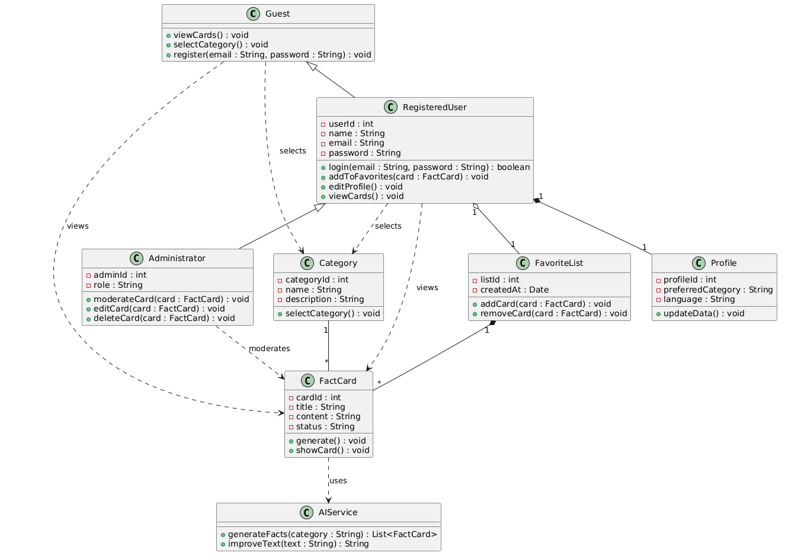

# Діаграми класів (Class Diagram)

У цьому розділі представлено об’єктно-орієнтовану структуру системи "Touch Up Smart", яка включає основні класи, їхні атрибути, методи та взаємозв'язки.

## Опис класів та атрибутів

* **Guest (Гість)**: Початковий клас для незареєстрованого користувача.
    * **Методи**: `viewCards()` (перегляд), `selectCategory()` (вибір теми), `register()` (створення акаунта).
* **RegisteredUser (Користувач)**: Клас для авторизованих користувачів. Успадковується від `Guest`.
    * **Атрибути**: `userId`, `username`, `password`, `email`, `name`, `preferences` (список обраних тем).
    * **Методи**: `login()`, `logout()`, `editProfile()` (редагування даних), `addToFavorites()` (збереження картки).
* **Administrator (Адміністратор)**: Спеціалізований клас для керування контентом. Успадковується від `RegisteredUser`.
    * **Атрибути**: `adminId`, `role` (рівень доступу).
    * **Методи**: `moderateCard()`, `editCard()`, `deleteCard()` (повне керування базою фактів).
* **Profile (Профіль)**: Клас, що зберігає персоналізацію користувача. Пов'язаний з `RegisteredUser` композицією.
    * **Атрибути**: `profileId`, `preferredCategory`, `language`.
    * **Методи**: `updateData()`.
* **Category (Категорія)**: Клас для організації контенту.
    * **Атрибути**: `categoryId`, `name`, `description`.
    * **Методи**: `selectCategory()`.
* **FactCard (Факт-картка)**: Основний елемент контенту.
    * **Атрибути**: `cardId`, `title`, `content` (текст), `imageUrl` (посилання на фото), `status`.
    * **Методи**: `generate()` (створення за допомогою ШІ), `showCard()`, `display()` (візуалізація).
* **FavoriteList (Список обраного)**: Клас-контейнер для збережених карток користувача. Пов'язаний агрегацією з `FactCard`.
    * **Атрибути**: `favoriteId`, `createdAt`.
    * **Методи**: `addCard()`, `removeCard()`.
* **AIService (Сервіс ШІ)**: Зовнішній сервіс для роботи з текстами.
    * **Методи**: `generateFacts()` (створення нових фактів), `improveText()` (редагування існуючих).

## Візуалізація


## Код діаграми (PlantUML)
```puml
@startuml
class Guest {
  + viewCards() : void
  + selectCategory() : void
  + register(email : String, password : String) : void
}

class RegisteredUser {
  - userId : int
  - username : String
  - password : String
  - email : String
  - name : String
  - preferences : List
  + login() : boolean
  + logout() : void
  + editProfile() : void
  + addToFavorites(card : FactCard) : void
  + viewCards() : void
}

class Administrator {
  - adminId : int
  - role : String
  + moderateCard(card : FactCard) : void
  + editCard(card : FactCard) : void
  + deleteCard(card : FactCard) : void
}

class Profile {
  - profileId : int
  - preferredCategory : String
  - language : String
  + updateData() : void
}

class Category {
  - categoryId : int
  - name : String
  - description : String
  + selectCategory() : void
}

class FactCard {
  - cardId : int
  - title : String
  - content : String
  - imageUrl : String
  - status : String
  + generate() : void
  + showCard() : void
  + display() : void
}

class FavoriteList {
  - favoriteId : int
  - createdAt : Date
  + addCard(card : FactCard) : void
  + removeCard(card : FactCard) : void
}

class AIService {
  + generateFacts(category : String) : List
  + improveText(text : String) : String
}

Guest <|-- RegisteredUser
RegisteredUser <|-- Administrator
RegisteredUser "1" *-- "1" Profile
RegisteredUser "1" o-- "1" FavoriteList
FavoriteList "1" o-- "*" FactCard
Category "1" *-- "*" FactCard

Guest ..> Category : selects
Guest ..> FactCard : views
RegisteredUser ..> Category : selects
RegisteredUser ..> FactCard : views
FactCard ..> AIService : uses
Administrator ..> FactCard : moderates
@enduml
