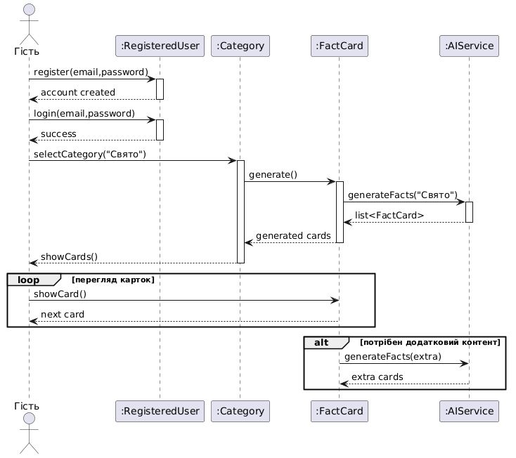

# Діаграма послідовності (Sequence Diagram)

Ця діаграма відображає динамічну взаємодію об'єктів у системі для реалізації ключового сценарію: «Гість реєструється, після чого користувач обирає категорію та отримує картки».

## Опис сценарію
Сценарій охоплює виконання наступних функціональних вимог:
* **FR-04 (Реєстрація/Вхід):** Гість створює обліковий запис та авторизується в системі.
* **FR-01 (Вибір категорії):** Користувач взаємодіє з об'єктом `Category`.
* **FR-02 (Генерація карток) та FR-08 (Інтеграція з AI):** Система звертається до `AIService` для формування контенту.
* **FR-03 (Перегляд карток):** Реалізовано через цикл (`loop`) для послідовного перегляду фактів.
* **Додатково:** Використано фрагмент `alt` для перевірки необхідності додаткової генерації контенту.

## Візуалізація


## Код діаграми (PlantUML)
```puml
@startuml
actor "Гість" as Guest
participant ":RegisteredUser" as User
participant ":Category" as Cat
participant ":FactCard" as Card
participant ":AIService" as AI

Guest -> User : register(email,password)
activate User
User --> Guest : account created
deactivate User

Guest -> User : login(email,password)
activate User
User --> Guest : success
deactivate User

Guest -> Cat : selectCategory("Свято")
activate Cat
Cat -> Card : generate()
activate Card
Card -> AI : generateFacts("Свято")
activate AI
AI --> Card : list
deactivate AI
Card --> Cat : generated cards
deactivate Card
Cat --> Guest : showCards()
deactivate Cat

loop перегляд карток
    Guest -> Card : showCard()
    Card --> Guest : next card
end

alt потрібен додатковий контент
    Card -> AI : generateFacts(extra)
    AI --> Card : extra cards
end
@enduml
